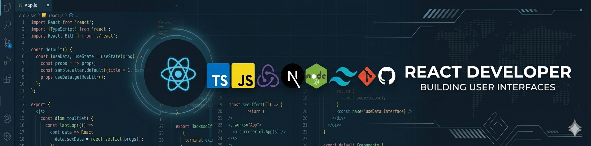

<h1 align="center">Hello I'm Shubhangi Bhosale</h1>

  
  

  

## 👨🏻‍💻 About Me:

- 🙋‍♂️ All about me is at **[My Website](https://shubhangibhosale.vercel.app/)**

* 💼 Frontend Developer with professional experience in React ecosystem

* ⚛️ Building modern web applications using React, TypeScript, Redux, and REST APIs

* 🌱 Currently exploring Next.js, performance optimization, and scalable frontend architecture

* 🚀 Passionate about clean code, reusable components, and great user experiences

* 🤝 Always interested in learning, sharing knowledge, and collaborating with fellow developers

* 💬 Let's talk about React, JavaScript, Frontend Development, and UI Engineering

* 🎯 Focused on writing maintainable, scalable, and high-quality code

* ⚡ Fun Fact: I can spend hours perfecting a UI pixel by pixel

## 🛠️ Technologies and Tools I use:

## ❤️ Let's get connected:

  

## 📊 My GitHub Data:

  
  

